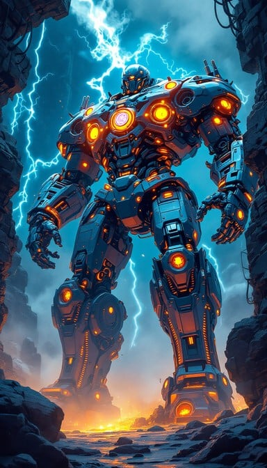

# 🤖 ULTRON Atlas GUI & Web Dashboard

[](https://app.netlify.com/start/deploy?repository=https://github.com/dqikfox/atlas-gui)
[](https://vercel.com/import/project?template=https://github.com/dqikfox/atlas-gui)

> A cyberpunk-themed AI agent interface featuring real-time system monitoring, multi-provider AI chat, and automation tools with stunning blue energy aesthetics.



## 🖥️ Interface Preview


*The modern React interface featuring real-time system monitoring, AI chat, activity logs, and automation controls.*

## 🌟 Overview

**ULTRON Atlas GUI** is a multi-component AI agent dashboard system that combines Python backends, React frontends, and static HTML interfaces. Built with a cyberpunk aesthetic featuring the signature ULTRON blue (`#00d4ff`) and energy green (`#00ff88`) color scheme.

### ⚡ Key Features

- 🤖 **Multi-Provider AI Chat** - OpenAI, Anthropic, Google AI, Groq, Ollama
- 📊 **Real-Time System Monitoring** - CPU, Memory, Disk usage with live updates
- 🎮 **PyAutoGUI Automation** - Computer vision and desktop automation
- 🌐 **Multiple Deployment Options** - Static hosting, full-stack, or hybrid
- 🎨 **Cyberpunk UI/UX** - Dark theme with neon energy effects
- 🔊 **Voice Integration** - Text-to-speech and voice recognition
- 📱 **Mobile Responsive** - Works on desktop and mobile devices

## 🏗️ Architecture

### 🔧 System Components

```
atlas-gui/
├── 🐍 Python Backend Services
│   ├── ultron_web_server.py      # Main FastAPI web server
│   ├── agent_core.py             # AI agent orchestration
│   ├── voice_manager.py          # Voice synthesis & recognition
│   ├── ultron_vision.py          # Computer vision & OCR
│   └── real-system-monitor.py    # Live system metrics
│
├── ⚛️ React Frontend (ultron-agent/)
│   ├── src/components/           # React UI components
│   ├── src/hooks/                # Custom React hooks
│   ├── package.json              # Node.js dependencies
│   └── README.html               # Component documentation
│
├── 🌐 Static Dashboard (public-dashboard/)
│   ├── index.html                # Self-contained dashboard
│   └── README.md                 # Deployment guide
│
└── 🎨 Assets & Documentation
    ├── imgs/                     # Cyberpunk artwork
    ├── screenshots/              # UI demonstrations
    └── docs/                     # Technical documentation
```

## 🚀 Quick Start

### Option 1: Static Dashboard (60 seconds) 🌐

Perfect for demos and public deployment without backend dependencies.

```bash
# Clone and serve
git clone https://github.com/dqikfox/atlas-gui.git
cd atlas-gui/public-dashboard
python -m http.server 8000

# Visit: http://localhost:8000
```

**Deploy instantly:**
- **Netlify**: Drag `public-dashboard/` folder to [netlify.com/drop](https://app.netlify.com/drop)
- **Vercel**: Upload folder at [vercel.com](https://vercel.com)
- **GitHub Pages**: Enable in repository settings

### Option 2: React Frontend Development ⚛️

Modern React app with TypeScript and real-time features.

```bash
# Setup React app
cd atlas-gui/ultron-agent
npm install
npm start

# Development server: http://localhost:3000
```

### Option 3: Full Python Backend 🐍

Complete AI agent with all features enabled.

```bash
# Install Python dependencies
pip install fastapi uvicorn websockets psutil pillow pytesseract

# Configure environment
cp .env.example .env
# Edit .env with your API keys

# Start the server
python ultron_web_server.py

# Web interface: http://localhost:8000
```

## 🎯 Component Details

### 🐍 Python Backend

**Core Services:**
- **FastAPI Web Server** (`ultron_web_server.py`) - Main API and WebSocket server
- **AI Agent Core** (`agent_core.py`) - Multi-provider AI orchestration
- **Voice Manager** (`voice_manager.py`) - TTS/STT integration
- **Vision System** (`ultron_vision.py`) - OCR and computer vision
- **System Monitor** (`real-system-monitor.py`) - Live hardware metrics

**API Endpoints:**
```
GET  /                    # Main dashboard
POST /chat               # AI chat interface
GET  /status             # System health
POST /voice/start        # Voice listening
POST /automation/screenshot  # Screen capture
WebSocket /ws            # Real-time updates
```

### ⚛️ React Frontend

**Modern Stack:**
- React 18 + TypeScript
- Custom hooks for state management
- Lucide React icons
- CSS custom properties for theming
- Real-time WebSocket integration

**Key Components:**
- `ActivityLogPanel` - Chronological activity tracking
- `AIChatPanel` - Multi-provider chat interface  
- `SystemMonitorPanel` - Live system metrics
- `AutomationPanel` - PyAutoGUI controls

### 🌐 Static Dashboard

**Single-File Solution:**
- Complete dashboard in one HTML file
- No build process required
- Works offline after initial load
- Randomized demo data
- Instant deployment to static hosts

## 🎨 Customization

### Color Scheme
```css
:root {
  --ultron-blue: #00d4ff;      /* Primary ULTRON blue */
  --energy-green: #00ff88;     /* Success/active states */
  --warning-orange: #ffaa00;   /* Warnings/energy cores */
  --danger-red: #ff3366;       /* Errors/critical states */
  --dark-bg: #0a0a0a;         /* Background */
  --panel-bg: #1a1a1a;        /* Panel backgrounds */
}
```

### Adding Custom Tools

1. **Frontend**: Add UI controls in automation panel
2. **Backend**: Implement endpoint in `ultron_web_server.py`
3. **Integration**: Connect via fetch API or WebSocket

```python
# Python backend endpoint
@app.post("/custom/tool")
async def custom_tool():
    return {"status": "success", "message": "Tool executed"}
```

```javascript
// Frontend integration
async function executeCustomTool() {
    const response = await fetch('/custom/tool', {method: 'POST'});
    const result = await response.json();
}
```

## 🔧 Development Workflows

### Frontend Development (React)
```bash
cd ultron-agent
npm start          # Development server
npm test           # Run tests
npm run build      # Production build
```

### Backend Development (Python)
```bash
# Install development dependencies
pip install pytest black flake8

# Run with auto-reload
uvicorn ultron_web_server:app --reload --host 0.0.0.0 --port 8000

# Test individual components
python test_ultron_functions.py
```

### Static Dashboard Updates
```bash
cd public-dashboard

# Test locally
python -m http.server 8000

# Deploy to Netlify (CLI)
npm install -g netlify-cli
netlify deploy --prod --dir .
```

## 📊 System Requirements

### Minimum Requirements
- **Python**: 3.8+
- **Node.js**: 16+ (for React development)
- **RAM**: 4GB minimum, 8GB recommended
- **Disk**: 2GB free space

### Optional Dependencies
- **Tesseract OCR** - For vision/OCR features
- **Ollama** - For local AI models
- **ElevenLabs API** - For voice synthesis

## 🔐 Configuration

### Environment Variables
```bash
# Copy example configuration
cp .env.example .env

# Add your API keys
OPENAI_API_KEY=your_key_here
ANTHROPIC_API_KEY=your_key_here
OLLAMA_BASE_URL=http://localhost:11434
ELEVENLABS_API_KEY=your_key_here
```

### API Provider Setup

1. **OpenAI**: Get API key from [platform.openai.com](https://platform.openai.com)
2. **Anthropic**: Sign up at [console.anthropic.com](https://console.anthropic.com)
3. **Google AI**: Enable at [makersuite.google.com](https://makersuite.google.com)
4. **Ollama**: Install locally from [ollama.ai](https://ollama.ai)

## 🚀 Deployment Options

### 1. Static Hosting (Fastest)
- **Netlify**: Drag & drop deployment
- **Vercel**: Git integration
- **GitHub Pages**: Free hosting
- **Surge.sh**: CLI deployment

### 2. VPS/Cloud Hosting
```bash
# Ubuntu/Debian setup
sudo apt update
sudo apt install python3-pip nodejs npm
git clone https://github.com/dqikfox/atlas-gui.git
cd atlas-gui
pip install -r requirements.txt
python ultron_web_server.py
```

### 3. Docker Deployment
```dockerfile
FROM python:3.11-slim
WORKDIR /app
COPY . .
RUN pip install fastapi uvicorn websockets
EXPOSE 8000
CMD ["python", "ultron_web_server.py"]
```

## 🐛 Troubleshooting

### Common Issues

**"ULTRON components not found"**
- Ensure all Python files are in the same directory
- Check import paths in `ultron_web_server.py`

**"WebSocket connection failed"**
- Verify server is running on correct port
- Check firewall settings

**"React app won't start"**
- Run `npm install` in `ultron-agent/` directory
- Ensure Node.js version 16+

**"Ollama models not loading"**
- Start Ollama service: `ollama serve`
- Verify accessible at `localhost:11434`

### Debug Mode
```bash
# Python backend with debug logging
python ultron_web_server.py --log-level debug

# React with verbose output
cd ultron-agent && npm start --verbose
```

## 📈 Performance

- **WebSocket Updates**: Real-time with <100ms latency
- **System Monitoring**: Updates every 5 seconds
- **Memory Efficient**: Auto log rotation (100 entries max)
- **Responsive UI**: Optimized animations and transitions

## 🌟 Browser Support

- **Chrome**: 90+
- **Firefox**: 88+
- **Safari**: 14+
- **Edge**: 90+
- **Mobile**: iOS 14+, Android 8+

## 🤝 Contributing

1. **Fork** the repository
2. **Create** a feature branch: `git checkout -b feature/amazing-feature`
3. **Commit** changes: `git commit -m 'Add amazing feature'`
4. **Push** to branch: `git push origin feature/amazing-feature`
5. **Open** a Pull Request

### Development Guidelines
- Follow existing code style
- Add tests for new features
- Update documentation as needed
- Test on multiple browsers/devices

## 📄 License

This project is licensed under the MIT License - see the [LICENSE](LICENSE) file for details.

## 🎨 Credits

- **Design**: Inspired by Atlas cyberpunk aesthetics
- **Icons**: Lucide React icon library
- **Fonts**: System fonts with cyberpunk styling
- **Color Scheme**: ULTRON blue energy theme

## 🔗 Related Projects

- [ULTRON Agent Documentation](ULTRON_AGENT_COMPLETE.md)
- [Web Dashboard Guide](ULTRON_WEB_DASHBOARD_README.md)
- [Integration Plan](integration_plan.md)
- [Atlas Design Document](ultron_atlas_design_document.md)

---

<div align="center">

**🤖 Built with AI • Powered by Python & React • Styled with Cyberpunk Energy ⚡**

[Demo](https://atlas-gui-demo.netlify.app) • [Documentation](docs/) • [Issues](https://github.com/dqikfox/atlas-gui/issues) • [Discussions](https://github.com/dqikfox/atlas-gui/discussions)

</div>